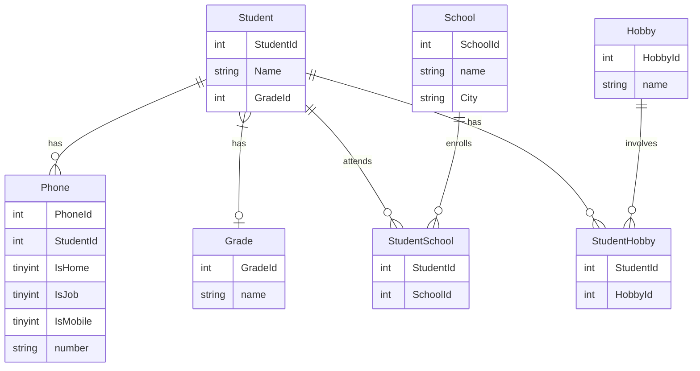

# db2022



## Normalisera databas

```bash
cd ws
cd db2022
docker exec -i iths-mysql mysql -uiths -piths < normalisering.sql
winpty docker exec -it iths-mysql bash
mysql -uiths -piths
```

## Köra java kod

```bash
gradle check
```

